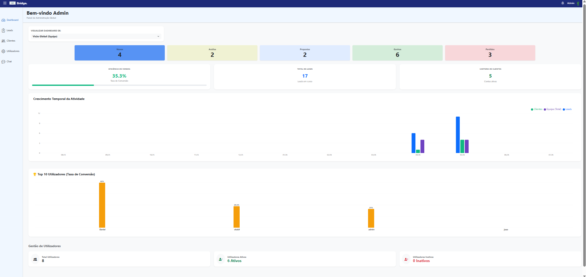
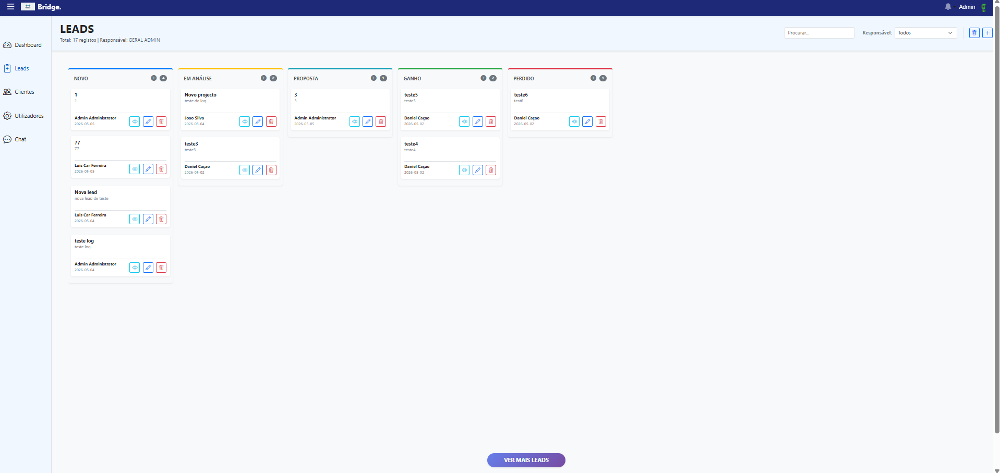
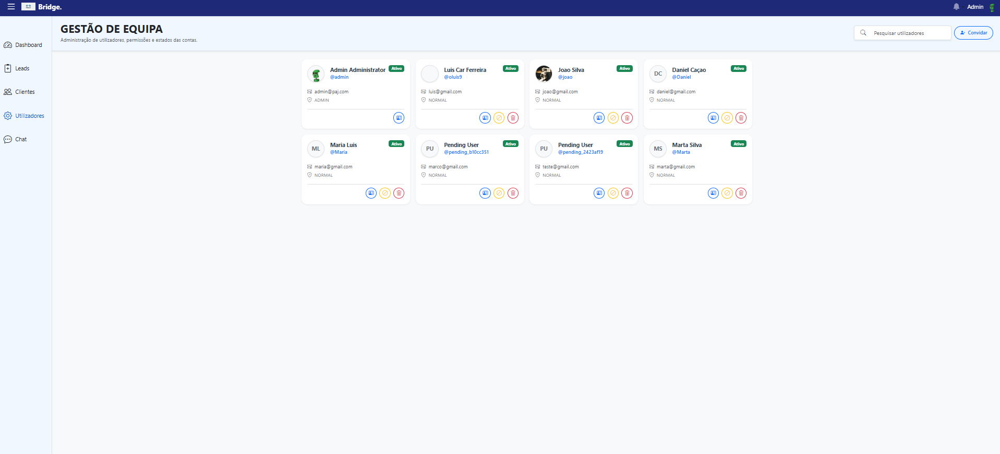
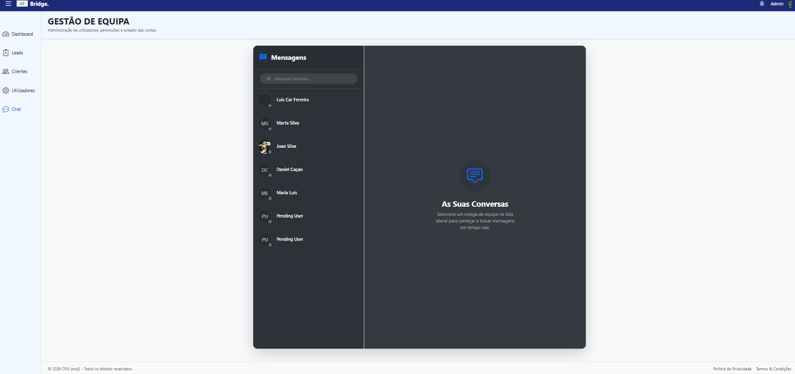
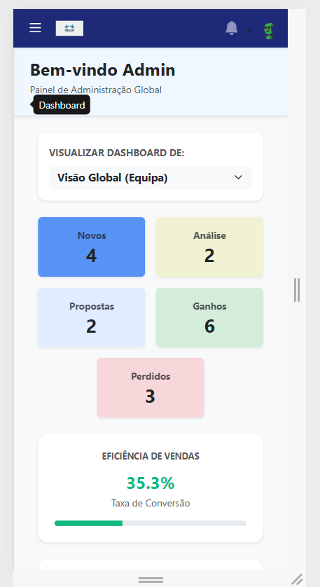

# 🚀 CRM e Gestão de Leads - Trabalho Prático 5 (PAJ)


Este projeto foi desenvolvido como o **Trabalho Prático 5** para a cadeira de Programação Avançada em Java (Curso Acertar o Rumo, FCTUC). Consiste numa aplicação web robusta (Frontend e Backend) para gestão de utilizadores, clientes e leads, incorporando funcionalidades avançadas em tempo real e boas práticas de arquitetura de software.

## 📸 Demonstração

### Versão Desktop
<div style="display: flex; gap: 10px; flex-wrap: wrap;">
  
  
  
  
</div>

### Versão Mobile
<div style="display: flex; gap: 10px; flex-wrap: wrap;">
  

</div>

## 🌟 Principais Funcionalidades

- **Segurança e Contas:** 
  - Confirmação de contas via e-mail (links únicos e expirados).
  - Recuperação de passwords (reset via link com token temporal).
  - Session timeout com logout automático após inatividade.
  - Hashes seguros de passwords (BCrypt).
- **Tempo Real (WebSockets):**
  - Chat 1-para-1 com histórico completo.
  - Sistema de notificações globais com contador dinâmico e marcação de "lida".
  - Atualização em tempo real do dashboard e das leads.
- **Gestão de Utilizadores e Perfis:**
  - Perfis detalhados por URL único (`/users/{username}`).
  - Dashboard para o Administrador com estatísticas e gráficos de evolução (utilizando *Recharts*).
  - Listagem de utilizadores filtrável, com paginação e ordenação feitas diretamente no backend para maior eficiência.
- **Auditoria e Logs:**
  - Registo persistente de atividades relevantes (CRUDs, acessos, falhas de segurança), guardando data, hora e token associado.
- **Internacionalização (i18n):**
  - Suporte completo para Português (PT) e Inglês (EN) através de `react-i18next`.
  - Preferências de idioma guardadas por utilizador.
- **Interface Responsiva:**
  - Layout *Mobile-first* garantindo adaptação perfeita a Mobile, Tablet e Desktop.

## 🛠️ Stack Tecnológico

### Backend (Jakarta EE)
- **Framework:** Jakarta EE 10 (JAX-RS, EJBs)
- **Persistência de Dados:** PostgreSQL com JPA (Hibernate)
- **Comunicação:** REST API + WebSockets
- **Segurança:** Autenticação por Tokens e validações (Hibernate Validator)
- **Testes:** JUnit 5, Mockito e integração com Selenium WebDriver

### Frontend (React)
- **Framework:** React 19 com Vite
- **Gestão de Estado:** Zustand
- **Navegação:** React Router v7
- **Estilização e Componentes:** Bootstrap 5, React Bootstrap, CSS (App.css / index.css)
- **Outras Bibliotecas:** Recharts (Gráficos), i18next (Internacionalização), React Responsive.

## 📁 Estrutura do Projeto

O projeto adota uma arquitetura em **Monorepo** para facilitar a visibilidade:

```text
PAJ-PROJETO5/
│
├── BACKEND/                  # Código fonte da API em Java (Jakarta EE)
│   ├── src/main/java         # Lógica de negócio, Serviços, DAOs, Websockets
│   ├── src/main/resources    # Configurações de BD (persistence.xml) e Logs
│   └── pom.xml               # Dependências do Maven
│
├── FRONTEND/                 # Aplicação Cliente (React + Vite)
│   ├── src/                  # Componentes, Páginas, Stores (Zustand), Serviços API
│   ├── public/               # Assets estáticos
│   └── package.json          # Dependências do NPM
│
├── docs/                     # Documentação adicional, enunciados e screenshots
│
└── README.md                 # Documentação do projeto

```


## 🚀 Como Iniciar o Projeto Localmente

### Pré-requisitos
- **Java 21** e **Maven** instalados.
- **Node.js** (v18+) instalado.
- Servidor de Aplicações configurado (ex: WildFly / JBoss) com uma Base de Dados **PostgreSQL** ativa.

### 1. Iniciar o Backend
1. Abra um terminal na pasta `BACKEND`.
2. Configure as credenciais da base de dados PostgreSQL no ficheiro `persistence.xml`.
3. Compile o projeto e gere o ficheiro WAR:
   ```bash
   mvn clean install
   ```
4. Faça o deploy do `.war` gerado (pasta `target/`) no seu servidor de aplicações (ex: WildFly).

### 2. Iniciar o Frontend
1. Abra um terminal na pasta `FRONTEND`.
2. Instale as dependências:
   ```bash
   npm install
   ```
3. Inicie o servidor de desenvolvimento:
   ```bash
   npm run dev
   ```
4. Aceda à aplicação através do endereço local fornecido pelo Vite (por norma, `http://localhost:5173`).

---
*Projeto desenvolvido no âmbito do Curso Acertar o Rumo (Universidade de Coimbra).*
